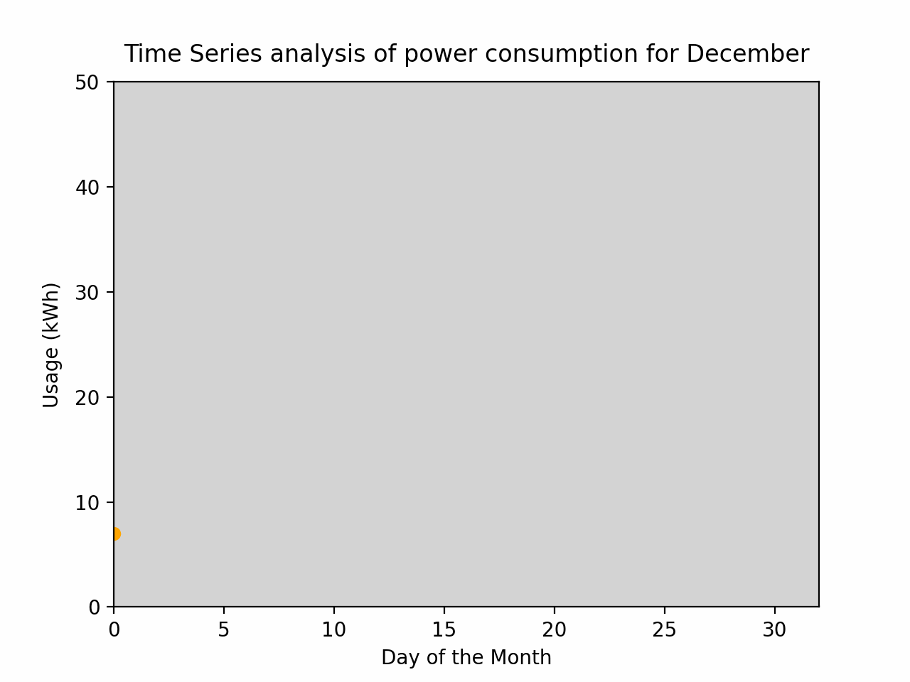
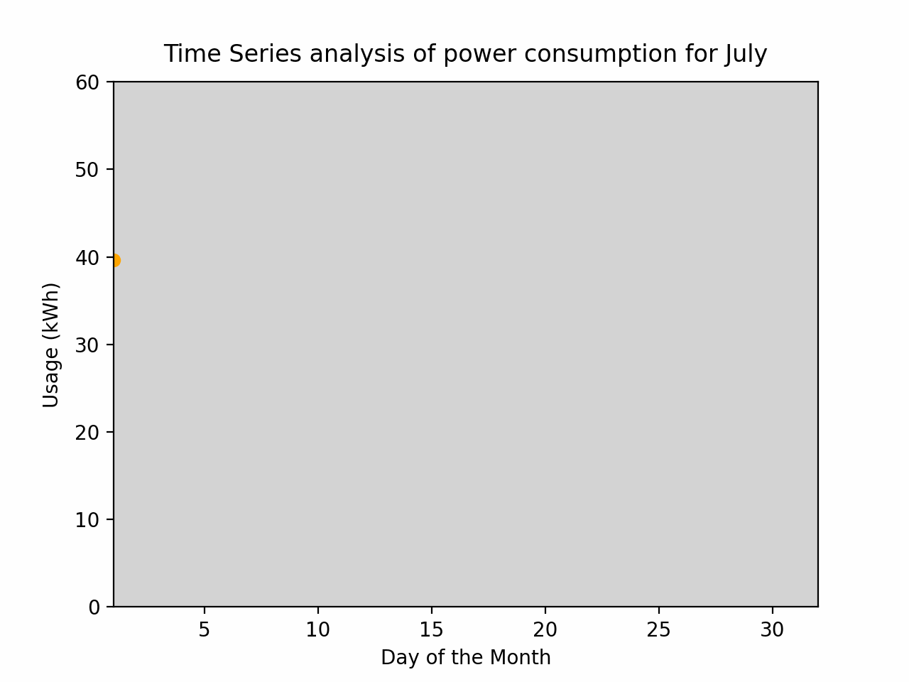
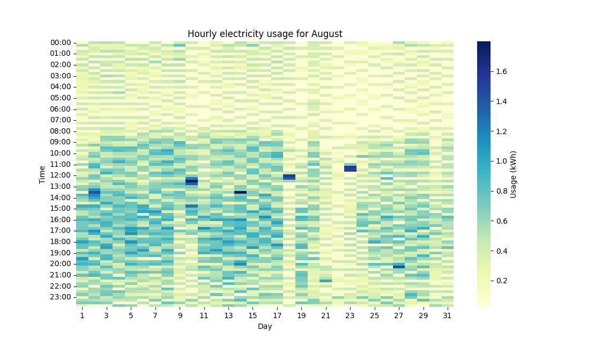

# EnergyDash

<table>
  <tr>
    <td align="center"></td>
    <td align="center"></td>
  </tr>
  <tr>
    <td colspan="2" align="center"></td>
  </tr>
</table>

## Overview

The electricity_usage project is a user-friendly tool that aids individuals in understanding their household electricity consumption, by taking into account data imported from the Texas smart meter website. Through this project, users can gain insights into their energy usage patterns and subsequently optimize their consumption for efficiency and savings.

Features
* Visual representation of monthly electricity usage
* Detailed reports of daily, weekly, and monthly consumption
* Comparative analysis of electricity usage over different periods
* Recommendations for optimizing electricity usage based on consumption patterns

## Installation

Requirements
Python 3.7 or newer
Required Python libraries: pandas, matplotlib, seaborn, numpy

Import your usage data from the Texas smart meter website. Make sure the data is in a .csv format and placed in the /data directory.

## Contributing

We appreciate all contributions to improve the electricity_usage project. Please feel free to submit a pull request or suggest ideas.

## Support

If you encounter any problems or have any questions about this project, please create a new issue in the repository.

## Authors and Acknowledgement

This project was created by github.com/rishabh01solanki. Special thanks to the Texas smart meter website for providing the electricity usage data.
